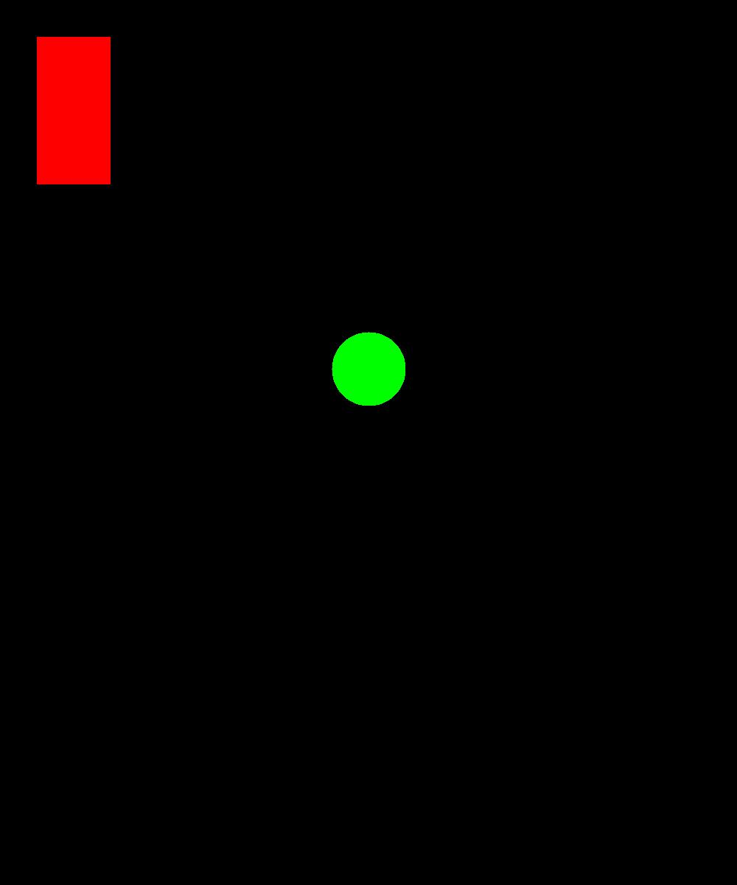

## Assignment - 1
You are provided a file (`render.txt`), with the format shown below. You are required to generate a [ppm file](https://en.wikipedia.org/wiki/Netpbm#PPM_example) containing shapes (rectangles and circles), as intructed in the `render.txt` file.

`render.txt:`
```
1000 1200
r 50 50 100 200 255 0 0
c 500 500 50 0 255 0
```
The above input should produce a 1000x1200 ppm image with a 100x200 rectangle at (50, 50) having color rgb(255, 0, 0) and a circle of radius 50 with center at (500, 500) having color rgb(0, 255, 0). The file may contain virtually any number of lines.

The output image for the input provided above should look something like this:


*Note: To view ppm files in Windows, you will need a third-party software like Photoshop*


## Submission
To submit your assignments, create a directory with name as your github username, and place your code inside that directory (you don't need to provide the output image generated).